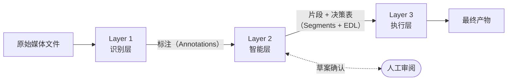
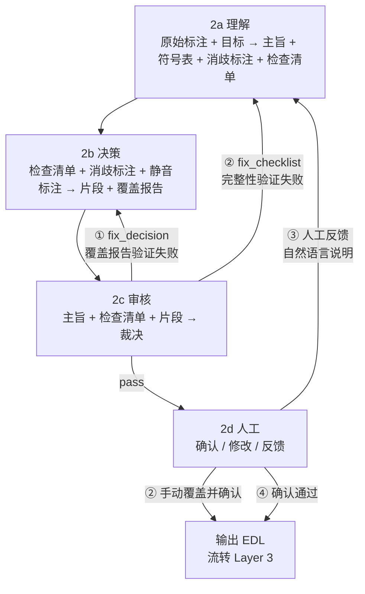

# AutoSmartCut — 时间轴媒体语义基础设施

> 一套以时间轴清单（TimelineManifest）为核心资产、分三层流转的语义处理管道：**识别层**把原始媒体转化为标注，**智能层**通过「理解→决策→审核→人工」四子阶段循环将标注转化为剪辑决策表，**执行层**将决策渲染为最终产物。每层产物单向叠加、可持久化、可重跑；人工介入固定在智能层末尾；扩展能力通过节点注册而非修改主干实现。

---

## 目录

1. [项目定义](#1-项目定义)
2. [名词表](#2-名词表)
3. [核心数据模型](#3-核心数据模型)
4. [三层管道](#4-三层管道)
5. [横切关注点](#5-横切关注点)
6. [架构本质：时间轴媒体的语义编译器](#6-架构本质时间轴媒体的语义编译器)
7. [核心资产带来的结构性能力](#7-核心资产带来的结构性能力)
8. [可能性空间](#8-可能性空间)
9. [核心风险与应对](#9-核心风险与应对)
10. [一句话总结](#10-一句话总结)

---

## 1. 项目定义

> **一套针对时间轴媒体的语义处理管道。它做的事情本质上只有一件：把原始媒体文件，编译成一份携带完整语义标注的时间轴清单，再基于这份清单做任意后续决策。**

视频文件是输入，不是系统的核心资产。**时间轴清单（TimelineManifest）才是核心资产。**

这不是一个剪辑工具——剪辑只是这份语义资产最显而易见的消费方式，但远非唯一。视频剪辑是第一个应用，但架构的射程是一切时间轴媒体的语义化。

---

## 2. 名词表

| 中文名 | 英文 | 简明解释 |
|--------|------|---------|
| 时间轴清单 | TimelineManifest | 贯穿整条管道的中心数据结构。记录原始媒体的所有识别结果、语义理解、剪辑决策，是可序列化、可持久化、可传递的主资产 |
| 源媒体引用 | source_media | 清单里指向原始文件的信息（路径、格式、时长、轨道），不把二进制内容塞进清单 |
| 标注 | Annotation | 识别层产出的、带时间范围的结构化感知记录。每条表示「在某段时间，系统感知到了什么」（文字、静音、场景切换等） |
| 字级时间戳 | Char-level Timestamp | 强制对齐模型产出的逐字时间标记，通常挂在 `Annotation.metadata.char_timestamps` 中，是精确字幕、精确切点和语气词剪除的基础 |
| 句级聚合节点 | Sentence Aggregation Node | 识别层内的显式处理节点，将字级流按标点、停顿和长度上限切分为句级标注，同时保留字级明细 |
| 语义片段 | Segment | 智能层 2b 决策子阶段产出的、带语义标签与权重的时间单元。回答「这段内容在叙事/主题上是什么」 |
| 剪辑决策表 | EDL（Edit Decision List） | Layer 2 / 2b 决策子阶段输出的编辑决策列表。每条对应一段时间，指示保留、删除或重排等动作 |
| 识别层 | Layer 1 / Perception | 三层架构的第一层，只读源媒体、只写标注，不做语义判断 |
| 节点 | Node | 某个阶段内执行一件具体事情的处理单元（如一个 ASR 节点、一个静音检测节点）。统一接口：消费清单 → 产出清单 |
| 检查点 | Checkpoint | 阶段完成后将当前清单序列化落盘。下次可从该点继续，避免重跑代价高昂的步骤 |
| 只增不改 | Append-only | 节点只往清单上追加信息，不抹掉上游已写入的数据，保证信息累积与可追溯 |
| 中间表示 | IR（Intermediate Representation） | 编译器术语，对应本系统的时间轴清单：所有中间处理结果的统一承载结构 |
| 剪辑策略预设 | Preset | 同一份时间轴清单在 Layer 2 / 2b 决策子阶段套用的不同规则模板，可产出完全不同的成片（如完整版、精华版、短视频） |
| 智能层 | Layer 2 / Intelligence | 三层架构的中间层，内含「理解→决策→审核→人工」四子阶段与双层循环 |
| 执行层 | Layer 3 / Execution | 三层架构的末层，按剪辑决策表由 smartcut 执行 GOP 级精确剪切 |
| 主旨 | Purpose | 智能层 2a 理解子阶段产出的核心结论：内容的核心目标与关键信息点，是检查清单的生成依据 |
| 检查清单 | Checklist | 智能层 2a 产出的结构化评估框架，每条都是一项需要被 2b 决策子阶段覆盖的内容要点，含 must/optional 优先级 |
| 符号表 | Symbol Table | 智能层 2a 构建的术语/人名/实体映射表，记录 ASR 可能的误识形式与正确形式，是文本消歧的依据 |
| 消歧标注 | Cleaned Annotations | 智能层 2a 在不修改原始标注的前提下追加写入的校正文本视图，供 2b/2c 使用，避免原始 ASR 噪音直接流入决策 |
| 覆盖报告 | Coverage Report | 智能层 2b 决策子阶段自产、2c 审核子阶段验证的统计报告，说明检查清单各项是否被所选片段覆盖 |
| 人工反馈历史 | Human Feedback History | 智能层 2d 产出的人工操作记录，包含手动覆盖项与自然语言反馈文本，供下一轮重跑与审计使用 |
| Token 预算 | Token Budget | 代码层设定的智能层最大 token 消耗上限，由视频时长动态分配，用于控制循环轮次与 early stop |
| 审核子阶段 | Review Sub-stage (2c) | 智能层内部 LLM 自审阶段，基于主旨与检查清单对当前决策草案进行结构化核查，输出 pass/fix_decision/fix_checklist 三种裁决 |

---

## 3. 核心数据模型

整个系统围绕一个不断被丰富的结构流转：

```
时间轴清单（TimelineManifest）
├── source_media                    // [初始化] 源媒体引用：路径、格式、时长、轨道信息
│
├── annotations[]                   // [Layer 1 · 识别层] 识别层所有节点的输出叠加于此
│     {
│       t_start,                    // 开始时间（秒）
│       t_end,                      // 结束时间（秒）
│       type,                       // 标注类型（"asr" / "silence" / "scene" / ...）
│       content,                    // 内容（转写文字、事件描述等）
│       confidence,                 // 置信度
│       metadata                    // 开放式扩展字段，如 char_timestamps[] = [{text, start, end}]
│     }
│
├── comprehension                   // [Layer 2 · 2a 理解子阶段] 产出；2c 审核子阶段验证
│     {
│       purpose,                    // 主旨：内容的核心目标与关键信息点
│       checklist[],                // 检查清单：{item, priority(must|optional), covered}
│       symbol_table[],             // 符号表：{term, raw_form, category, first_occurrence}
│       cleaned_annotations[],      // 消歧标注：{annotation_index, cleaned_content}
│       content_map[]               // 叙事图谱（预留，中期扩展，MVP 置空）
│     }
│
├── segments[]                      // [Layer 2 · 2b 决策子阶段] LLM 产出的片段建议
│     {
│       t_start,
│       t_end,
│       label,                      // 语义标签（主题、类别等）
│       relevance,                  // 相关性/重要性权重
│       summary,
│       selected,                   // LLM 本轮建议（bool）；最终 keep/cut 由 selected + overrides 合并推导
│       metadata
│     }
│
├── review_reports[]                // [Layer 2 · 2c 审核子阶段] 每轮循环追加，只增不改
│     {
│       round,                      // 循环轮次（从 0 开始）
│       verdict,                    // 裁决：pass | fix_decision | fix_checklist
│       coverage_issues[],          // 覆盖问题列表（fix_decision 触发）
│       completeness_issues[],      // 完整性问题列表（fix_checklist 触发）
│       token_spent                 // 本轮消耗的 token 数
│     }
│
├── human_feedback_history[]        // [Layer 2 · 2d 人工子阶段] 每次人工操作追加，只增不改
│     {
│       round,                      // 对应哪一轮智能层快照
│       overrides[],                // 手动 toggle 记录：{segment_index, from: bool, to: bool}
│       feedback_text,              // 自然语言反馈文本；路径④确认通过时为 null
│       verdict                     // "confirm" | "feedback"
│     }
│
├── edl[]                           // [Layer 2 · 2d 最终确认] 路径④写入，是唯一的最终裁决
│     {
│       t_start,
│       t_end,
│       action                      // keep | cut | reorder | speed_up | ...
│     }
│
└── loop_metadata                   // [Layer 2 · 循环控制] 代码层元数据，非 LLM 产出
      {
        total_token_spent,          // 累计 token 消耗
        inner_rounds,               // fix_decision 内循环执行次数
        outer_rounds,               // fix_checklist 外循环执行次数
        final_verdict               // 最终裁决结果（pass | budget_exceeded | max_rounds）
      }
```

**三条设计原则：**

1. **统一接口（Uniform Interface）**：所有节点的形式统一为 `(清单, 配置) → 清单`，节点之间无需了解彼此内部实现。
2. **只增不改（Append-only）**：每个节点只在清单上叠加自己的输出，已有信息始终保留，便于追溯与多节点并行叠加。
3. **开放扩展字段（Open metadata）**：`annotations` 通过 `type` 字段区分来源；`metadata` 字段为开放式，各节点可自由扩展，天然向前兼容。

---

## 4. 三层管道

三层管道按时间轴语义逐级收敛、单向流转：**识别层（Layer 1）**负责把原始媒体转为结构化标注，完成音频提取、转写、字级对齐、句级聚合与静音推导，产出可计算的 `annotations[]`；**智能层（Layer 2）**是唯一与 LLM 交互的中枢，按「2a 理解 → 2b 决策 → 2c 审核 → 2d 人工」闭环运行，其中 2a 生成主旨/符号表/检查清单，2b 产出语义片段与覆盖报告，2c 给出 `pass`、`fix_decision`、`fix_checklist` 三类裁决并驱动内外循环，2d 负责人工确认、手动覆盖或反馈重跑，最终将结果编译为 EDL（Edit Decision List，剪辑决策表）；**执行层（Layer 3）**消费 EDL，按 GOP（Group of Pictures，画面组）级精确剪切策略完成输出，绝大多数区间直接搬运原始比特流，仅在切点邻域局部重编码，从而兼顾速度、精度与画质。



---

### 智能层内部子管道（四子阶段 + 双层循环）



**循环终止条件（代码层控制，非 LLM 判断）：**
- `verdict == pass`
- `rounds >= max_rounds`（循环上限）
- `token_spent >= token_budget`（Token 预算耗尽）
- `coverage >= early_stop_threshold`（覆盖率提前达标，默认 0.9）

---

### Layer 1 — 识别层（Perception）

**输入：** 任意格式视频文件（mp4 / mkv / mov 等，通过 PyAV 读取）

**输出：** 按时间顺序交替排列的 `speech` / `silence` 标注列表，写入 `annotations[]`，例如：

```
[speech  00:00.0–00:15.3  "大家好，今天我们来聊…"  confidence=0.92]
[silence 00:15.3–00:16.1]
[speech  00:16.1–02:41.0  "首先第一个话题是…"    confidence=0.88]
[silence 02:41.0–03:05.2]
…
```

**处理流程：**

1. **音频提取**：用 PyAV 从视频中解码音频，重采样为 16kHz 单声道 WAV，写入临时文件。此步是整个管道中唯一打开视频文件的操作，完成之后后续所有层均只操作清单（JSON），不再读取视频二进制内容。

2. **语音转写 + 强制对齐**：将 WAV 送入 Qwen3-ASR-1.7B 产出段落级转写文本，再由 Qwen3-ForcedAligner-0.6B 产出字级时间戳。两者结合后，单条语音观测同时拥有可读文本与字级切点精度。

3. **句级聚合**：识别层内部显式执行一个句级聚合节点，将字级流按 `raw_text` 中的标点（配置的全量标点集合）为主切分成句级 `Annotation`；字级时间戳用于把标点回填到时间轴。停顿不再作为主切分信号，仅在相邻 `speech` 段之间用于 `silence` 注入；`max_chars` 仍作兜底以防超长句。外层字段 `t_start/t_end/content` 供人和 LLM 阅读，字级明细保留在 `metadata.char_timestamps` 中。

4. **静音推导**：并非直接对音频做静音检测，而是从聚合后的语音序列推导；当某条语音标注的末字结束时间与下一条语音标注的首字开始时间之间的间隙超过阈值（默认 0.8 秒）时，在该区间插入一条 `type=silence` 标注。

5. **写入清单**：将全部 speech + silence 标注合并排序，追加到 `TimelineManifest.annotations[]`，保存检查点。

**关键性质：** 同层内各节点只读源媒体、互不依赖，**可全部并行执行**。MVP 阶段只有 ASR 一条线，并行价值体现在未来同时运行场景切换、人脸检测等节点时，Arc 识别时间由最慢节点而非各节点之和决定。

| 类型 | MVP 节点 | 未来可扩展节点（接口不变） |
|------|----------|--------------------------|
| 语音 | Qwen3-ASR 转写、Qwen3-ForcedAligner 字级对齐、句级聚合、间隙静音推导 | 声纹识别/说话人分离、情绪分析（语气/语调）、音乐/背景音检测 |
| 视频 | — | 场景切换检测、人脸检测与识别、OCR 画面文字提取、目标检测（广告画面/Logo）|

---

### Layer 2 — 智能层（Intelligence）

**输入：** 识别层产出的 `annotations[]` + 用户通过 `--goal` 指定的分析目标

**输出：** 语义片段列表（`segments[]`）、剪辑决策表（`edl[]`）、理解结果（`comprehension`）、审核报告列表（`review_reports[]`）

这一层是系统智能的核心，也是与 LLM 交互的唯一层。内部包含四个子阶段，由代码层控制形成两层嵌套循环。

---

#### 2a — 理解子阶段（Comprehension）

**输入：** 所有 `speech` 标注的原始文本视图 + `--goal` 目标描述

**LLM 做什么：** 2a 固定执行两轮。第 1 轮先从未经消歧的原始文本中提炼粗糙主旨并构建符号表；第 2 轮再把粗糙主旨和符号表显式喂回 LLM，对原始文本做语义消歧，同时精化主旨与检查清单。

**产出写入 `comprehension` 字段：**

- **第 1 轮（bootstrap）**：输入原始文本，产出粗糙主旨与 `symbol_table[]`。符号表记录专有名词、人名、术语等在上下文中的正确形式与原始 ASR 形式的对应关系。
- **第 2 轮（印证）**：输入原始文本 + 粗糙主旨 + 符号表，产出精化主旨、`cleaned_annotations[]` 与最终 `checklist[]`。其中 `cleaned_annotations[]` 只追加写入，不覆盖 Layer 1 的原始 `annotations[].content`，因此仍然遵循 Append-only。
- **主旨（purpose）**：一两句话，概括内容的核心目标与关键信息点。例如："本段讲解深度学习在视频处理中的三种应用路径，核心论点是端到端模型优于手工特征工程，以三个实验为证。"
- **检查清单（checklist）**：结构化列表，每条是"好的剪辑必须覆盖的内容要素"，含优先级（`must` / `optional`）。例如：

  | 优先级 | 要素 |
  |--------|------|
  | must | 三种应用路径的定义与对比 |
  | must | 端到端模型优越性的论据（含实验数据）|
  | optional | 未来发展方向展望 |
  | optional | 主持人开场寒暄 |

检查清单是后续 2b 决策和 2c 审核的**评估基准**，不只是 LLM 的内部想法。`symbol_table[]` 和 `cleaned_annotations[]` 则是 2a 对原始识别结果的语义校正层：原始文本保留用于审计，消歧文本供下游消费。

---

#### 2b — 决策子阶段（Decision）

**输入：** 2a 产出的检查清单 + `cleaned_annotations[]` + `silence` 标注

**LLM 做什么：** 基于消歧后的文本视图将连续的语义内容归组为语义片段（非逐句处理，按主题边界合并），对每个片段：

- 标注主题标签（`label`）
- 给出与 `--goal` 的相关性分数（`relevance`，0.0–1.0）
- 生成内容摘要（`summary`）
- 建议是否保留（`selected: bool`）

其中 `selected` 表示 **LLM 本轮建议**，不是最终 keep/cut 结论。最终状态在 2d 阶段由 `selected` 与 `human_feedback_history[].overrides` 合并推导；只有路径④确认通过后，才落盘为 `edl[]`。

**额外产出：覆盖报告**（作为 2c 审核的输入）——逐条检查清单，在当前 `selected=True` 的片段中是否有对应覆盖，哪些 `must` 项尚未被任何片段覆盖。覆盖报告由决策子阶段自产，在 2c 审核子阶段被独立验证（双保险）。

结果写入 `segments[]`。

---

#### 2c — 审核子阶段（Review）

**输入：** `comprehension.purpose` + `comprehension.checklist[]` + 当前 `segments[]`（含覆盖报告）

**LLM 做什么：** 对照主旨和检查清单，对当前已选片段集合做**结构化逐项核查**，而非整体评分：

- 每条 `must` 项是否在已选片段中被实质覆盖？
- 已选片段中是否存在明显不符合目标的内容（噪声）？
- 整体叙事逻辑是否连贯，还是存在明显断层？

**输出三种裁决**，写入 `review_reports[]`（每轮追加，只增不改）：

| 裁决 | 含义 | 后续动作 |
|------|------|----------|
| `pass` | 核心要素全覆盖，无明显噪声 | 流转到 2d 人工子阶段 |
| `fix_decision` | 某些 `must` 项未被覆盖，但清单本身完整 | 返回 2b，携带具体 `coverage_issues`（内循环①）|
| `fix_checklist` | 检查清单遗漏了重要内容维度 | 返回 2a，携带具体 `completeness_issues`（外循环②）|

**循环终止条件（代码层控制，LLM 不感知循环计数）：**

- `verdict == pass`
- `inner_rounds >= max_inner`（fix_decision 内循环上限）
- `outer_rounds >= max_outer`（fix_checklist 外循环上限）
- `token_spent >= token_budget`（Token 预算耗尽）
- `coverage_rate >= early_stop_threshold`（覆盖率提前达标，默认 0.9）

**三档配置：**

| 配置 | max_inner | max_outer | 说明 |
|------|-----------|-----------|------|
| Demo | 0 | 0 | 可行性验证，完全禁用循环，直通人工 |
| MVP  | 0 | 0 | 配置关闭，一次直通，人工承担审核兜底 |
| 完整版 | 动态 | 动态 | 按视频时长分配 Token 预算，动态决定循环次数 |

---

#### 2d — 人工子阶段（Human Review）

**输入：** 2c 审核通过（`pass`）后的 `segments[]` + 审核裁决理由

这是**整条管道唯一的人工介入点**，提供四种操作路径：

**① 审阅（只读）**

以列表形式展示全部片段，每行显示：时间范围、主题标签、相关性分数、keep/cut 状态、内容摘要。同时可见 2c 审核层的裁决理由：哪些 `must` 项仍未被完全覆盖、哪些片段被标记为疑似无关内容。

**② 手动覆盖决策**

用户可按编号直接切换任意片段的 keep/cut 状态，覆盖 LLM 的 `selected` 建议。系统不覆盖 `segments[].selected`，而是将人工变更以 `overrides[]` 追加写入 `human_feedback_history[]`，并基于 `selected + overrides` 实时刷新预计输出时长。确认后可直接编译为 EDL 流转 Layer 3；这条路径不触发 LLM 调用。

**③ 自然语言反馈（触发智能层循环）**

用户输入一段文字，描述对当前决策结果的评价或修正要求，例如"开场白虽然是寒暄，但包含了核心论点预告，应该保留"或"所有广告段不论内容一律删除"。

系统将本轮反馈以 `feedback_text` 追加写入 `human_feedback_history[]`，并从 **2a 理解子阶段重新开始执行**（路径③，直接回溯最上游）。新一轮 LLM 的输入基线是"上一轮快照"（`manifest_r(n-1).json`）；更早轮次只落盘保留，用于审计与回滚，不默认进入当轮上下文。

**④ 确认通过**

接受当前片段列表，将 `selected + overrides` 合并后的最终 keep 集合转换为 `action=keep` 的 EDL 记录，写入 `edl[]`，送入 Layer 3 执行。

| 操作 | 触发效果 | 是否调用 LLM |
|------|----------|-------------|
| 审阅（查看审核理由）| 只读，无状态变更 | 否 |
| 手动切换 keep/cut | 追加 overrides，刷新时长预览 | 否 |
| 自然语言反馈 | 重新执行 2a→2b→2c 全流程 | 是 |
| 确认通过 | 以 selected+overrides 合并结果编译 EDL，流转 Layer 3 | 否 |

---

### Layer 3 — 执行层（Execution）

**输入：** `edl[]` 中 `action=keep` 的时间区间列表（由 Layer 2 的 2d 人工子阶段写入）

**输出：** 单一视频文件，时长等于所有 keep 片段之和，非切点区域为原始比特流

**处理流程：**

1. **EDL 转换**：将 `edl[]` 中所有 `action=keep` 的记录提取为时间区间列表，时间值从浮点数转为 `Fraction`（有理数精确表示），避免浮点误差在高帧率视频中积累导致偏移。

2. **GOP 级精确剪切（smartcut）**：

   视频文件在编码层面以 GOP（画面组）为单位存储，而非逐帧独立。普通 FFmpeg 复制流切割只能在 GOP 边界切，切点精度约为一个 GOP 时长（H.264 通常 2–4 秒）；要达到帧精确必须全片重编码，速度与视频时长正相关，一小时视频需数十分钟。

   smartcut 的方案：绝大多数 GOP 直接**顺序搬运**（Remux，复制原始比特流，不解码不重编码）；仅在实际切点前后的极少数 GOP 处进行**局部重编码**。结果：

   - 剪切速度与视频时长**无关**，通常秒级完成
   - 非切点区域比特流原封搬运，**零质量损失**
   - 切点精度达到帧级别

3. **HEVC（H.265）特殊处理**：H.265 的 CRA/RASL 帧结构导致 naive 切割在切点附近出现花屏（RASL 帧依赖切点前的参考帧，切割后参考帧丢失）。smartcut 内建 hybrid recode 处理方案，自动识别并修复此问题，用户无需关心编码细节。

4. **多音轨处理**：原视频所有音轨自动 passthrough，无论原始文件有几条音轨（如主音轨 + 环境音轨 + 章节音频），全部按 keep 区间同步截取后保留到输出文件中。

**与 Layer 1 的数据闭环**：Layer 1 用 PyAV 提取音频进行 ASR；Layer 3 用 smartcut（底层同样基于 PyAV）读取视频做剪切。两处共用同一套 PyAV，不引入额外的 FFmpeg 集成方式。执行层结束之后，视频文件完整生命周期（打开→读取→关闭）终结，时间轴清单作为可永久保存的语义档案留存。

| 类型 | MVP 节点 | 未来可扩展节点 |
|------|----------|----------------|
| 剪切 | smartcut GOP 级精确剪切（含 HEVC hybrid recode）| 多格式/多平台输出（横屏/竖屏/多分辨率）、音频标准化 |
| 文字 | 字幕文件生成（基于 EDL 重新对齐 ASR 时间戳，输出 SRT/ASS）| 章节标记（YouTube Chapters）、导出为 NLE 工程文件（FCP/Premiere XML）|
| 其他 | — | 自动缩略图/封面生成 |

---

## 5. 横切关注点

### 检查点机制（Checkpoint）

每个阶段完成后，将当前时间轴清单序列化持久化到磁盘。

- ASR 等代价高昂的阶段不需要重跑
- Layer 2 智能层可以用不同策略多次重跑，不重复 Layer 1 识别与 2a 理解子阶段的计算成本
- 长视频处理不怕中断，从上次完成的阶段继续
- 支持增量追加：新增识别节点只需追加运行并叠加，已有标注不受影响
- 智能层每轮结束额外保存一份轮次快照（如 `manifest_r0.json`, `manifest_r1.json`）用于回滚
- LLM 下一轮默认只读取上一轮快照（`manifest_r(n-1).json`）作为输入基线，更早快照仅作审计与回滚
- **「多周目」不在 `TimelineManifest` 的 schema 字段中体现**：schema 只定义单份快照内部结构；多周目历史由快照文件命名约定承载（`manifest_r0.json`, `manifest_r1.json`, ...）

### 扩展接口（Extension Interface）

每个阶段对外暴露统一的节点注册接口。架构上预留位置，但 **MVP 阶段不需要实现任何插件系统**——插件能力是这套骨架自然生长出的结果，而不是需要提前建造的基础设施。

MVP 阶段可以硬编码四个最简节点跑通流程；待时间轴清单的数据模型在实践中被验证打磨后，插件化是自然的重构，而非提前的建造。

每个节点声明自己的依赖与产出，调度器据此做拓扑排序与并行编排：

```
节点声明（NodeMeta）：
  name:        节点唯一标识
  phase:       所属阶段（1/2/3）
  requires:    从清单中读取哪些字段（["tracks.audio"]）
  produces:    向清单写入哪些字段（["annotations.asr"]）
  depends_on:  必须在哪些节点之后执行
  config:      节点自身的配置项
```

---

## 6. 架构本质：时间轴媒体的语义编译器

这套系统与编译器存在**精确的结构对应**：

| 编译器 | 本系统 | 复用的成熟模式 |
|--------|--------|----------------|
| 源代码 | 原始媒体文件 | — |
| 词法分析（Lexing） | Layer 1 识别层 | 多种识别器可并行、可替换 |
| 语义分析（Semantic Analysis） | Layer 2 / 2a 理解子阶段 | 中间表示可缓存、可查询 |
| 符号表（Symbol Table） | `comprehension.symbol_table[]` | 在 2a 理解子阶段构建，后续各 pass 直接查阅，不再回溯原始字符串做重复判断 |
| 优化（Optimization） | Layer 2 / 2b 决策子阶段 | 多趟优化 pass 可组合、可迭代 |
| 代码生成（Code Generation） | Layer 3 执行层 | 多后端输出 |
| 中间表示（IR） | **时间轴清单（TimelineManifest）** | 可序列化、可版本控制、可在阶段间传递 |

编译器理论的数十年积累——多趟处理、增量编译、中间表示缓存、多后端——都可以自然复用。

---

## 7. 核心资产带来的结构性能力

以下不是功能规划，而是**架构自然涌现的能力**：

**可查询（Queryable）**
时间轴清单是按时间轴索引的语义数据库，天然支持结构化查询：「找出说话人 A 所有谈论主题 X 的片段」「列出置信度低于 0.7、需要人工复核的标注」「统计每个说话人的总发言时长」。只要标注足够结构化，查询就是免费的。

**可复用（Reusable）**
同一份时间轴清单，在 Layer 2 / 2b 决策子阶段套用不同的剪辑策略预设，即可产出完全不同的成片——完整版、精华版、15 秒社媒短视频——共享 Layer 1 识别层与 Layer 2 / 2a 理解子阶段的全部计算成本，只重跑代价极低的 2b 决策子阶段。

**可协作（Collaborative）**
时间轴清单是可序列化的 JSON，天然支持 git 版本控制、diff 对比、团队间分享。一个人跑完 Layer 1 识别层与 Layer 2 / 2a 理解子阶段，把清单发给团队，其他人各自做 Layer 2 / 2b 决策子阶段。两人对同一视频的不同剪辑决策，理论上可以 merge 对比。

**可增量（Incremental）**
后续新增一个识别节点（如场景检测），只需追加运行并把结果叠加到已有清单上，不需要从头重跑，Layer 2 / 2a 理解子阶段可以利用更丰富的输入重新理解。这是长视频批处理场景下体验差别最大的设计。

**可审计（Auditable）**
每条标注携带来源节点标记，可追溯任何标注的产出者、时间、模型版本。整个处理过程可完整回溯，不存在「黑箱决策」。

**可反馈（Feedback Loop）**
人工在 Layer 2 / 2d 人工子阶段修正剪辑决策表，本身就是对 Layer 2 / 2a 理解子阶段质量的隐式反馈；修正 ASR 错误就是语音模型的微调标注数据。积累足够多的时间轴清单后，可以训练「编辑风格模型」——学习某个剪辑师的决策偏好，自动生成符合其风格的剪辑决策。这形成**数据飞轮**：使用 → 产出标注 → 改进模型 → 更好的使用。

---

## 8. 可能性空间

### 近期（MVP 后自然延伸）

- 多种剪辑策略预设：播客清理、课程浓缩、会议纪要、高光集锦
- 字幕样式定制与多语言翻译
- 批量处理（多文件队列）
- 时间轴清单的可视化审阅界面

### 中期（新节点注册即可实现）

- **声纹识别** → 自动区分说话人 → 按说话人拆分输出或生成多说话人字幕
- **图像识别** → 自动识别广告/Logo → Layer 2 / 2b 决策子阶段自动删除广告段落
- **多机位合并** → 多路时间轴清单按时间轴对齐 → Layer 2 / 2b 决策子阶段做自动切换
- **直播弹幕融合** → 弹幕时间轴与视频清单合并 → 弹幕密度峰值自动标注高光时刻
- **多版本同时输出** → 一次 Layer 2 决策，Layer 3 执行层并行生成横屏/竖屏/多分辨率版本

### 远期（架构极限形态）

- **流式处理（Streaming）**：Layer 1 识别层、Layer 2 智能层实时运行，实现**自动直播导播**——多机位直播中，系统实时构建清单、实时做出切换决策
- **Agent Loop 自动审阅**：vLLM 检查成片连贯性后自动迭代修改 Layer 2 智能层，人工只做最终确认
- **时间轴清单开放标准**：作为比传统 EDL/AAF 更语义化的媒体交换格式，供不同工具链读写
- **跨媒体类型泛化**：播客（纯音频）、音乐（节拍/段落分析）、监控（目标检测/事件标注）、游戏录像（击杀/精彩时刻）——一切沿时间轴展开、可被多维标注的数据，都适用这套架构

---

## 9. 核心风险与应对

| 风险 | 说明 | 应对 |
|------|------|------|
| **智能层是系统天花板** | Layer 2 / 2a 理解子阶段是最难的部分，也是价值核心，目前 LLM 方案有准确性上限 | 架构已将其隔离为独立阶段，可从最简实现起步，随多模态模型成熟逐步升级，不影响其他层 |
| **清单格式演进兼容性** | 时间轴清单是核心资产，schema 变更可能导致旧清单不可用 | 从第一天起使用开放式 `type` + `metadata` 字段；制定版本号规范；旧清单可通过迁移脚本升级 |
| **MVP 过早建设插件系统** | 提前建造扩展基础设施会显著增加初期复杂度 | MVP 阶段硬编码四个最简节点跑通即可；让数据模型先在实践中被验证，插件化是后续自然重构 |
| **长视频清单体积膨胀** | 2 小时视频的密集标注可能使清单文件非常大 | 检查点分段存储 + 按需懒加载；稀疏标注（只存边界，不存每帧） |
| **智能层人工审阅 UX 门槛** | 缺乏好用的可视化界面会使人工介入体验差 | 这是产品问题，不是架构问题；架构已将人工介入点固定在 Layer 2 / 2d 人工子阶段，界面层独立迭代 |
| **Layer 1 并行资源竞争** | 多个识别节点同时读取大文件、占用 GPU 可能产生资源竞争 | 调度器负责资源感知编排；识别层节点可声明资源需求，调度器控制并发度 |
| **智能层 Token 消耗** | LLM 多轮循环可能导致 token 消耗失控，运行成本难以预测 | 代码层设置 Token Budget 硬上限（按视频时长动态分配）+ early_stop_threshold（coverage≥0.9 提前退出）；Demo/MVP 阶段禁用循环，token 消耗固定可预测 |

---

## 10. 一句话总结

> 以**时间轴清单（TimelineManifest）**为核心资产，分三层单向流转：**识别层**把原始媒体转化为标注，**智能层**通过四子阶段循环（理解→决策→审核→人工）把标注转化为剪辑决策表与完整语义理解结果，**执行层**把决策表渲染为最终产物。每层产物只增不改、可持久化、可重跑；人工介入固定在智能层末尾；扩展能力通过节点注册实现，不修改主干。视频剪辑是第一个应用，架构的射程是一切时间轴媒体的语义化。
