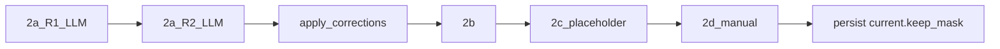

# 智能层设计（Layer 2）— MVP 现行版

> 本文档是 Layer 2 在 MVP 阶段的唯一实现依据，只记录当前确认的设计，不包含历史方案与演进过程。  
> 架构愿景见 [AutoSmartCut.md](AutoSmartCut.md)，MVP 全局规划见 [AutoSmartCut-MVP.md](AutoSmartCut-MVP.md)。

---

## 目录

1. [文档定位](#1-文档定位)
2. [术语与命名约定](#2-术语与命名约定)
3. [MVP 范围与边界](#3-mvp-范围与边界)
4. [数据模型（Layer 2 相关）](#4-数据模型layer-2-相关)
5. [2a 理解子阶段](#5-2a-理解子阶段)
6. [2b 决策子阶段](#6-2b-决策子阶段)
7. [2c 审核子阶段（MVP 两阶段）](#7-2c-审核子阶段mvp-两阶段)
8. [2d 人工子阶段（MVP）](#8-2d-人工子阶段mvp)
9. [Pipeline 时序](#9-pipeline-时序)
10. [与 Layer 1 / Layer 3 的契约](#10-与-layer-1--layer-3-的契约)
11. [层间清单与 EDL 归属](#11-层间清单与-edl-归属)

---

## 1. 文档定位

- 本文只覆盖 Layer 2（智能层）在 MVP 阶段的实现设计。
- 上游 Layer 1、下游 Layer 3 仅描述必要接口契约，不展开实现细节。
- 本文不包含多周目、循环控制、预算守卫、结构化反馈回流等 MVP 之后能力。

---

## 2. 术语与命名约定

为避免历史文档中的命名歧义，本文统一使用以下名称：

- **理解分块（2a 产物）**：`comprehension.outline_blocks[]`  
每个块包含 index 范围与块总结（可选块标题）。
- **决策结果（2b/2d 产物）**：`current.keep_mask[]`（与 `**tokens[]`** 等长并按 `index` 对齐，亦即与 `**annotations[]**` 条数相同）  
用于表示每条句面的 keep/cut 建议与人工覆盖后的最终有效决策。
- **主坐标系统**：`annotation.index`  
Layer 2 的语义处理坐标统一用 index，不用时间戳做主输入。

---

## 3. MVP 范围与边界

### 3.1 MVP 内

- 单周目、线性 pipeline：`2a -> 2b -> 2c(占位) -> 2d -> 定稿 keep_mask（对外交付）`。
- 2a：**两次 LLM 调用（R1 + R2）** + **一次程序步骤**（按 R2 的 `corrections` 生成 `cleaned_annotations`，不调用 LLM）。
- 2b 固定一次 LLM 调用。
- 2d 只提供手动勾选（index 级）与确认；**智能层（含 2d）对外的最终产物是定稿 `keep_mask`**，不产出 EDL。

### 3.2 MVP 外

- 不做多周目（不从 2d 回流 2a/2b）。
- 不做结构化反馈输入框 1/2/3/4。
- 不做 checklist 驱动流程（MVP 暂不启用 checklist 作为决策/审核主约束）。
- 不做 Token 使用量与预算策略（统一移至 `after-mvp-todo.md`）。

---

## 4. 数据模型（Layer 2 相关）

### 4.1 输入字段

- **磁盘**：智能层从 `**timeline_manifest.json`** 读取清单（至少含非空 `**annotations[]**`、可选 `goal` 等）。
- `manifest.goal`（内存 `manifest_dict`）：用户剪辑目标。
- `**manifest.tokens[]`（必需，仅内存）**：由 `annotation_tokens.tokens_from_annotations(annotations)` 生成稠密 `tokens`（每项仅 `index`、`text`），**不落盘**。时间轴 `**t_start`/`t_end`/`gap_after` 不进入 LLM Prompt**，留在同清单的 `**annotations[]`**，供 **Layer 3** 与执行层纯函数使用。
- **与 Layer 1 的关系**：L1 已把句级结果写入清单 `**annotations[]`**；L2 **不**再依赖独立 `layer2_input.json`。
- **LLM 句面**：2a 的 R1/R2 **只消费 `tokens[]` + `goal`**，不把时间字段塞进 Prompt。

### 4.2 2a 写入字段（`manifest.comprehension`）

- `purpose`：最终主旨。
- `outline_blocks[]`：分块结果（index 范围 + 块总结）。
- `cleaned_annotations[]`：虚拟消歧文本（`annotation_index` + `cleaned_content`，字段名沿用 MVP），
**稠密全量**，与 `**tokens[]`** 等长且按 `index` 对齐。

### 4.3 2b 写入字段

- `keep_mask[]`：与 `**tokens[]**` 等长；每条均为 `keep=true|false`（**仅布尔**）。MVP **不使用** `keep: null`；句间静音由 Layer1 的 `gap_after` 表达，**无**独立 `type=silence` 标注行。
- `checklist_coverage[]`：MVP 阶段作为预留字段，可为空。

### 4.4 2c 写入字段（`manifest.review_reports[]`）

- Phase A：可写入一条 `verdict="pass"` 的占位报告。
- Phase B：真实审核上线后按审核结果写入。

### 4.5 2d 写入字段

- `human_feedback_history[]`：MVP 仅记录手动覆盖操作与最终确认（不含自然语言反馈）。
- **定稿 `keep_mask`**：用户确认后，将 `effective_keep = merge(keep_mask, overrides)` 作为**智能层最终输出**写回清单 `**current.keep_mask`**（与 `**tokens[]**` / `**annotations[]**` 等长、按 `index` 对齐**）。
- **不在 Layer 2 生成或持久化 `edl[]`**：剪辑决策表（EDL）**不属于**智能层产出，见 [§11](#11-层间清单与-edl-归属)。

### 4.6 2a 中间产物（不持久化）

以下字段**主要存在于单次 `run_2a` 的内存中**；其中 `**corrections`** 等按现行实现可落入 `**current.comprehension**` 以便审计与重算，**不**单独要求「整段 R1 粗结果」落盘：

- R1：`purpose_rough`、`outline_blocks_rough`、`candidate_misrecognitions`
- R2：`corrections`（唯一错词替换映射；结构见 §5）

R2 结束后可丢弃 R1 粗结果等中间结构；**不**持久化 `symbol_table` / `symbol_table_candidates` 等别名字段。

---

## 5. 2a 理解子阶段

### 5.1 执行方式

1. **R1（LLM）**：粗主旨 + 粗分块 + 疑似错词候选表。
2. **R2（LLM）**：精化主旨 + 精化分块 + **错词唯一替换表** `corrections`。
3. **程序（非 LLM）**：根据 `corrections` 在 `**tokens[].text` 的只读映射/副本**上做替换，
  再回填为**稠密全量** `**comprehension.cleaned_annotations[]`**；
   **不**改写清单内 `annotations[].content`；**不**修改已载入的 `**tokens[]` 原文**（消歧结果仅存在于内存 `comprehension`，落盘策略见 `manifest_io.strip_volatile_fields`）。

LLM 调用走 `autosmartcut.intelligence_llm`（见 **§5.1.1**）。R1 为单轮；R2 与 R1 为**同一对话前缀上的第二跳**（真多轮，利于前缀缓存命中），而非两次互不关联的单轮请求。

#### 5.1.1 LLM 封装与多轮契约（现行实现）

| 能力           | 入口                                             | 说明                                                                                                             |
| ------------ | ---------------------------------------------- | -------------------------------------------------------------------------------------------------------------- |
| 单轮结构化        | `call_llm_structured` / `call_once_structured` | `system` + `user`（含 JSON Schema 格式说明）；非流式                                                                      |
| R1 单轮 + 原文快照 | `call_once_structured_with_raw_content`        | 返回 `StructuredLLMResult`：`data`、`assistant_content`（模型返回的 JSON 字符串）、`usage`、`request_messages`（深拷贝，供 R2 前缀）    |
| 多轮下一跳        | `call_turn_structured(messages, schema, …)`    | 对 `messages` 先 `sanitize_messages_for_api`（去掉 `reasoning_content`），再对**最后一条** `role=user` 追加 JSON 格式说明后请求      |
| 拼接 R1→R2     | `prepare_next_turn_messages`                   | 在 `request_messages` 后追加 `assistant`（仅 `content`）与 R2 的 `user`（由 `intelligence_2a._build_r2_user_followup` 构造） |

思考模式与采样：

- 模块内常量 `**ENABLE_REASONING_R1`** / `**ENABLE_REASONING_R2**`（默认 `False`）分别控制 R1/R2 是否启用 reasoner。
- 思考模式下 `**_call_api` 不传 `temperature**`（与 DeepSeek 文档一致）；若配置为 `deepseek-chat` 且开启思考，则通过 `extra_body={"thinking":{"type":"enabled"}}`。
- 跨轮**不得**把历史轮的 `reasoning_content` 拼进 `messages`（由 `sanitize_messages_for_api` 保证）。

2b 仍为**单轮**调用，使用 `call_llm_structured`（与 `call_once_structured` 等价）。

输出校验使用 `**jsonschema.Draft202012Validator`**（实例与 schema 合法性）。

### 5.2 R1 输出（中间态，仅内存）

- `purpose_rough`：粗糙主旨。
- `outline_blocks_rough[]`：草稿分块，`start_index` / `end_index` / `topic`（或等价主题字段）。
- `candidate_misrecognitions[]`：疑似 ASR 误识，每条含 `annotation_index`（句子 index）、`wrong`（原文错误子串）、`suggestions[]`（候选正确写法）。

### 5.3 R2 输出（中间态，仅内存）

- `purpose`：精化主旨。
- `outline_blocks[]`：最终分块，每项含 `start_index` / `end_index` / `**summary`**（供 2b Prompt 使用；若模型输出 `topic`，实现层映射为 `summary`）。
- `corrections[]`：唯一替换列表，每项含 `index`、`old`（原文错误子串）、`nth`（该子串在原句中第几次出现，1-based）、`new`（替换词）。

### 5.4 程序步骤输出（写入 `manifest.comprehension`）

持久化字段仅三项（与 §4.2 一致）：

- `purpose`（来自 R2）
- `outline_blocks[]`（来自 R2，字段名为 `summary`）
- `cleaned_annotations[]`：**仅**由程序根据 `corrections` 生成；为稠密全量列表，
每条均为 `{annotation_index, cleaned_content}`。未发生纠错的句子，
`cleaned_content` 与对应 `**tokens[].text`** 相同。

### 5.5 输入与不变量

- **R1 文本输入**：`manifest["tokens"]`（内存稠密句面）+ `goal`。
- **R2 文本输入**：在同一会话中，上一条 `**assistant`** 消息为 R1 的完整 JSON（含 `purpose_rough`、`outline_blocks_rough`、`candidate_misrecognitions`）；本回合 `**user**` 不再重复粘贴上述字段全文，而是显式引用「上一轮 JSON」，并仍附带**完整句面列表**（`[index] text`）及候选条目的**原句核对**（供 `corrections` 锚定）。语义与旧版「把 R1 输出塞进单条 Prompt」等价，但前缀与 R1 的 `system`+首条 `user` 一致，利于上下文缓存。
- **清单 `annotations[].content` 与内存 `tokens[].text` 不被覆盖**；消歧仅通过 `cleaned_annotations[]` 旁路表达（Append-only 语义）。

---

## 6. 2b 决策子阶段

### 6.1 输入（固定）

- `comprehension.cleaned_annotations[]`（稠密全量，与 `**tokens[]`** 等长对齐）
- `comprehension.purpose`
- `comprehension.outline_blocks[]`（块 index 范围 + 块总结）
- `**manifest.tokens[]**`：构造 Prompt 中的全量句面列表；**不**把 `annotations[]` 的时间字段塞进 LLM（时间轴在同清单 `annotations[]`，由 L3 消费）。

### 6.2 输出

- `keep_mask[]`（长度必须等于 `len(tokens)`）
- `checklist_coverage[]`（MVP 预留）

### 6.3 校验与重试

- 必须校验 `keep_mask` 的长度、索引对齐、类型约束。
- 失败时整体重试，最多 3 次。

---

## 7. 2c 审核子阶段（MVP 两阶段）

### 7.1 Phase A（先交付）

- 真实审核逻辑不启用。
- 写入一条占位报告：`verdict="pass"`，用于维持 schema 兼容与流程一致性。

### 7.2 Phase B（后续交付）

- 再接入真实 LLM 审核逻辑（`pass/fix_decision/fix_checklist`）。
- 相关循环与预算策略不属于 MVP 本文范围。

---

## 8. 2d 人工子阶段（MVP）

### 8.1 仅保留手动勾选

- 展示当前决策结果（可按 index 或按块辅助展示）。
- 用户手动切换指定 index 的 keep/cut。
- 变更记录写入 `overrides` delta，不原地改写模型原始 `keep_mask`。

### 8.2 合并与确认

- 有效决策：`effective_keep = merge(keep_mask, overrides)`。
- 用户确认后：将 `**effective_keep` 固化为定稿 `keep_mask`**，写回 `**timeline_manifest.json`** 的 `**current.keep_mask**`，作为交给执行层的决策载体；**不在此处合成 `edl[]`**。

### 8.3 明确边界

- 2d 覆盖的是 2b 决策输出。
- MVP 不支持在 2d 提交反馈回流 2a/2b。

---

## 9. Pipeline 时序

---

## 10. 与 Layer 1 / Layer 3 的契约

- Layer 2 与 Layer 1 对齐依赖 **句级 `index` 稳定一致**（内存 `tokens` 与清单 `annotations` 逐条对应）。
- **智能层（含 2d）对执行层的交付物是定稿 `current.keep_mask`**（与 `**tokens**` / `**annotations[]**` 等长）；**不是** `edl[]`。
- 识别层输出中带 `**index`、`t_start`、`t_end` 与 `gap_after`** 的句级序列，构成「时间–index 映射」；执行层用其与 `keep_mask` 合并后**在内部**得到连续时间上的 keep 区间，再**在执行层内部**合成 EDL 并驱动剪切。
- Layer 2 语义决策主坐标为 `index`；**时间换算与 EDL 合成**属于执行层职责。
- **执行层（MVP）**在合成浮点保留区间后，还可选用 **Silero VAD 切点吸附（Snap）** 微调入/出点（不写回源文件）；与 L2 契约无关，详见 [AutoSmartCut-MVP.md](AutoSmartCut-MVP.md) 中 `[execution]` 与 `--no-vad-snap`。

---

## 11. 层间清单与 EDL 归属

- **解耦方式**：识别层、智能层、执行层通过**同一份** `**timeline_manifest.json`** 约定字段路径交接（字段级以 [AutoSmartCut-MVP-Mini.md](AutoSmartCut-MVP-Mini.md) 与 [AutoSmartCut-MVP.md](AutoSmartCut-MVP.md) 为准）。
- **识别层写入**：`annotations[]`（含 `index`、`t_start`、`t_end`、`gap_after` 等），即执行层所需的「时间–index 映射」来源。
- **智能层写入**：`current.comprehension` 与 `**current.keep_mask`**（经 2b 与 2d `overrides` 合并后的定稿；MVP 默认无 overrides 时即 2b 输出）。
- **EDL**：由**执行层**读取清单内 `**annotations[]` + `current.keep_mask`** 后，在**执行层内部**合并计算得到；**不作为 Layer 2 的对外落盘字段**。

---

*文档版本：0.5.0*  
*状态：MVP 现行实现依据（单清单 + 内存 `tokens[]`；2a R1+R2 真多轮与 `intelligence_llm` API；2026-04-11 与仓库对齐）*  